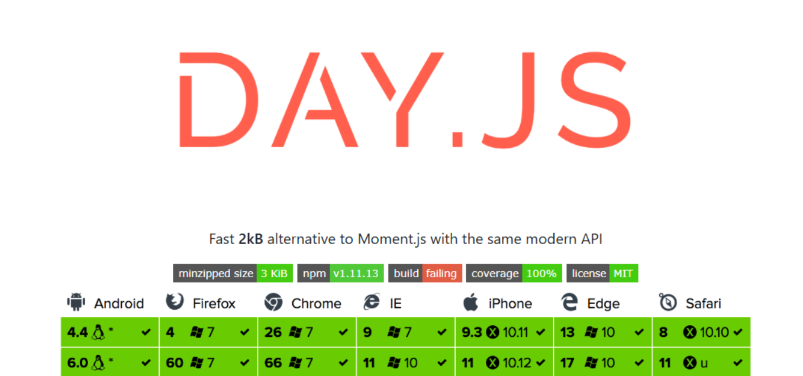
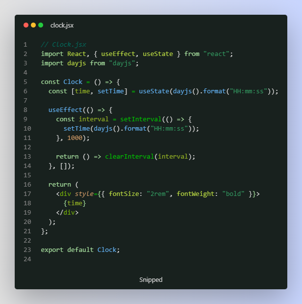

# DAY-JS bo'yicha qo'llanma . O'rnatish , Foydalanish
## DayJS bizga vaqtlar bilan ishlashni osonlashtirib beradigan kichik kutubxona hisoblanadi. 
## Hajmi: 2kb 




## O'rnatish:
- npm i dayjs

## Foydalanish:
- dayjs().format()                  
- dayjs().format('YYYY-MM-DD')       
- dayjs().format('DD/MM/YYYY')       
- dayjs().format('HH:mm:ss')       

## Js :
```
dayjs().format()                    // 2025-04-07T12:34:26+05:00    
dayjs().format('YYYY-MM-DD')        // 2025-04-07
dayjs().format('DD/MM/YYYY')        // 07/04/2025
dayjs().format('HH:mm:ss')          // 12:39:27
```


### Formatlar:
- YYYY – yil
- MM – oy
- DD – kun
- HH – soat (24 soatlik)
- mm – daqiqa
- ss – soniya


## ReactJs da xozirgi vaqtni ko'rsatadigan soat yasaymiz :
